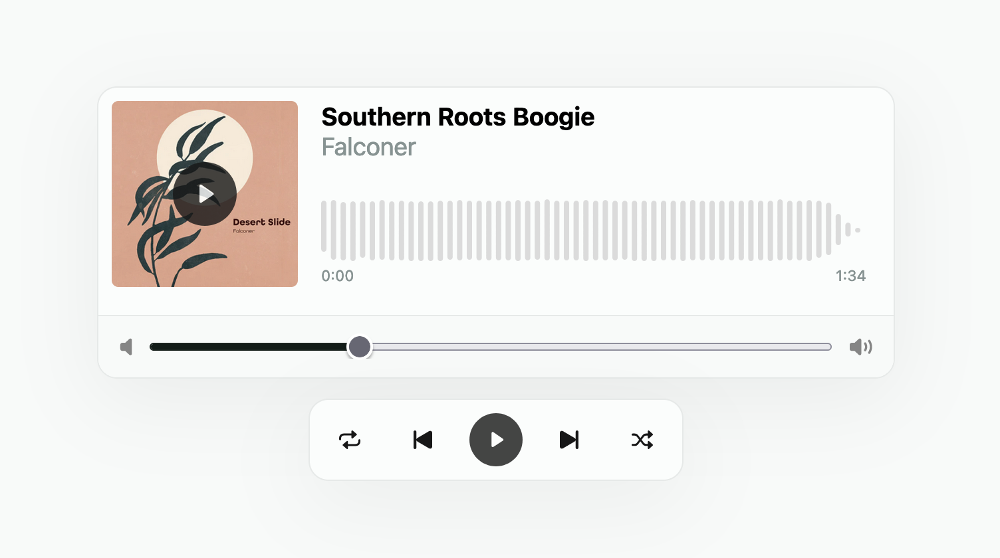

# Audio player

This repository contains the source code for the Audio Player challenge proposed by [Significa](https://significa.co/). The project includes an audio player to play songs from the `data` folder. You can play, pause, skip forward and backward, adjust volume, and view song information.

You can find more details above. ⬇️

## Layout Preview

You can find the prototype design, which is based on [where](https://www.figma.com/file/jbkDpuET4jQVQmJZqN8Hgd/Dev-challenge---Media-player?type=design&node-id=201%3A4165&t=98lin7BvmyS01ouM-1)

Additionally to the prototype, I added a play icon that you can find in the folder /assets/icons.

## Technologies Used

Here you can find the framework/tools, that were chosen to build the solution:
- [React](https://react.dev/) - used as the main framework to construct the application logic;
- [Vite](https://react.dev/) - used to create the boilerplate and run the project;
- [Tailwindcss](https://tailwindcss.com/) - used to build the project styles quickly;
- [Wavesurfer/react](https://github.com/katspaugh/wavesurfer-react) - used to create the waveform of each song and manage the sound playback;
- [TypeScript](https://www.typescriptlang.org/) - used to maintain the application complexity as long as the project grows.

## Getting Started

1. Clone the repository: `git clone https://github.com/edupaulos/audio-player.git`;
2. Enter in the project folder: `cd audio-player`;
3. Run `yarn wizard` ✨ -> this will install dependencies and run the project;

## Usage

1. After the wizard command you can only run `yarn dev` to start the project
2. Preview in [http://localhost:5174/](http://localhost:5174/)

## To be improved

- Optimize the wavesurfer implementation;
- Add unit test with [istanbul](https://jestjs.io/) and coverage with [istanbul](https://istanbul.js.org/)
- Implement shuffle and repeat;
- On music completed change to next one;
- Implement a UI volume controller closer to the prototype. This may be easier with a component lib since the tailwind doesn't provide much customization to the input rage.

## Audio assets

- [Audio and cover files](./audio-player-assets.zip)
